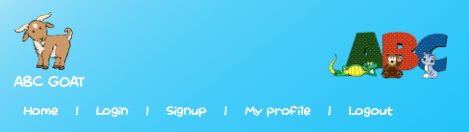
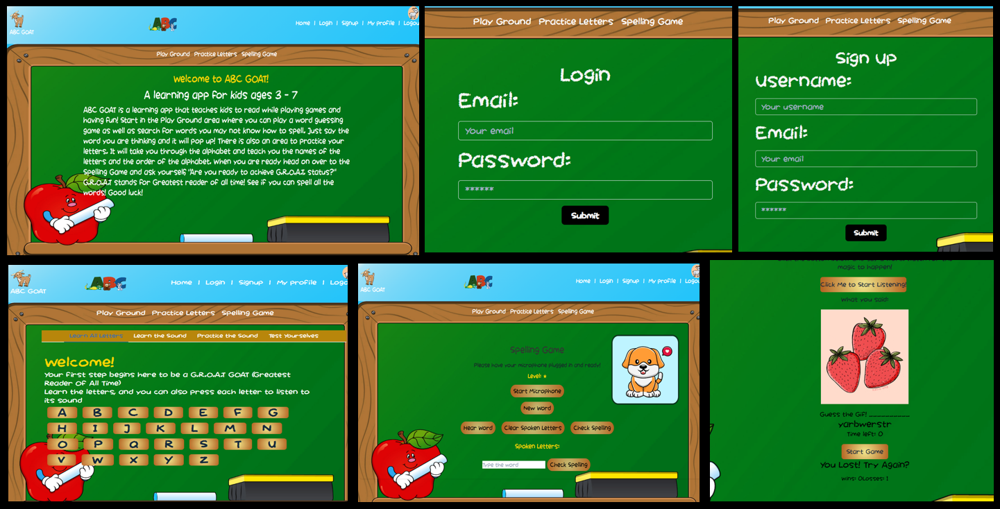

  
  # ABC Goat   [](https://choosealicense.com/licenses/mit/.)  
  
  ## Table of Contents
  - [Description](#project-description)
  - [Installation](#installation)
  - [Usage](#usage)
  - [Contribution](#contribution)
  - [Credits](#credits)


  ## Project Description

ABC GOAT is a learning app that teaches kids to read while playing games and having fun!   
The game offers a play ground where the user can play a word guessing game, or just say words and see pictures associated with the word pop up!  
The Practice Letters page allows the user to learn the alphabet through various activities, such as hearing each letter, learning each letter's sound, and then practicing them.  There is also a Spelling Game that the user can play.

  

  ## Technologies Used  
  [annyang](https://www.npmjs.com/package/annyang)  
  [SpeechSynthesis](https://developer.mozilla.org/en-US/docs/Web/API/Web_Speech_API)  
  [React](https://react.dev/learn) and various React libraries such as react-awesome-reveal, react-router-dom, react-scripts  
  [Apollo Client](https://www.npmjs.com/package/@apollo/client)
  [GraphQL](https://graphql.org/)  
  [jwt-decode](https://www.npmjs.com/package/jwt-decode)  
  [axios](https://www.npmjs.com/package/axios)  
  [Giphy API](https://developers.giphy.com/)

   
  ### License 
  
  [](https://choosealicense.com/licenses/mit/.)
  
```md
MIT License

Copyright (c) 2023

Permission is hereby granted, free of charge, to any person obtaining a copy
of this software and associated documentation files (the "Software"), to deal
in the Software without restriction, including without limitation the rights
to use, copy, modify, merge, publish, distribute, sublicense, and/or sell
copies of the Software, and to permit persons to whom the Software is
furnished to do so, subject to the following conditions:

The above copyright notice and this permission notice shall be included in all
copies or substantial portions of the Software.

THE SOFTWARE IS PROVIDED "AS IS", WITHOUT WARRANTY OF ANY KIND, EXPRESS OR
IMPLIED, INCLUDING BUT NOT LIMITED TO THE WARRANTIES OF MERCHANTABILITY,
FITNESS FOR A PARTICULAR PURPOSE AND NONINFRINGEMENT. IN NO EVENT SHALL THE
AUTHORS OR COPYRIGHT HOLDERS BE LIABLE FOR ANY CLAIM, DAMAGES OR OTHER
LIABILITY, WHETHER IN AN ACTION OF CONTRACT, TORT OR OTHERWISE, ARISING FROM,
OUT OF OR IN CONNECTION WITH THE SOFTWARE OR THE USE OR OTHER DEALINGS IN THE
SOFTWARE.
```
  
  ## Installation 
  Clone the repo.   
  Then run "npm install" in the terminal.  
  Next run "npm seed" to seed the data for the words.


  ## Usage 
  Run "npm run develop" in the terminal to start the server and client.  
  The web app will be available at http://localhost:3000/ when ran locally.


  ## Contribution
  This project is open to coders who want to collaborate and contribute.


  
# Credits

With the help and guidance of the staff of the UofM coding boot camp, as well as the resources at W3 and the Mozilla Developers Network.  

  

Nate Trask  - https://github.com/N8Trask  
Jenna Strom - https://github.com/JennaStrom  
Nafbek Kebede -  https://github.com/Nafbek  
Chee Lor - https://github.com/CML120

  

# Resources  

[Giphy Devlopers documentation](https://developers.giphy.com/docs/sdk/#webhttps://developer.mozilla.org/en-US/docs/Web/API/SpeechRecognition)  
[Balsamiq Cloud - wireframing](https://balsamiq.cloud/)  
[MDN Web Docs](https://developer.mozilla.org/en-US/)  
[W3Schools](https://www.w3schools.com/)  


